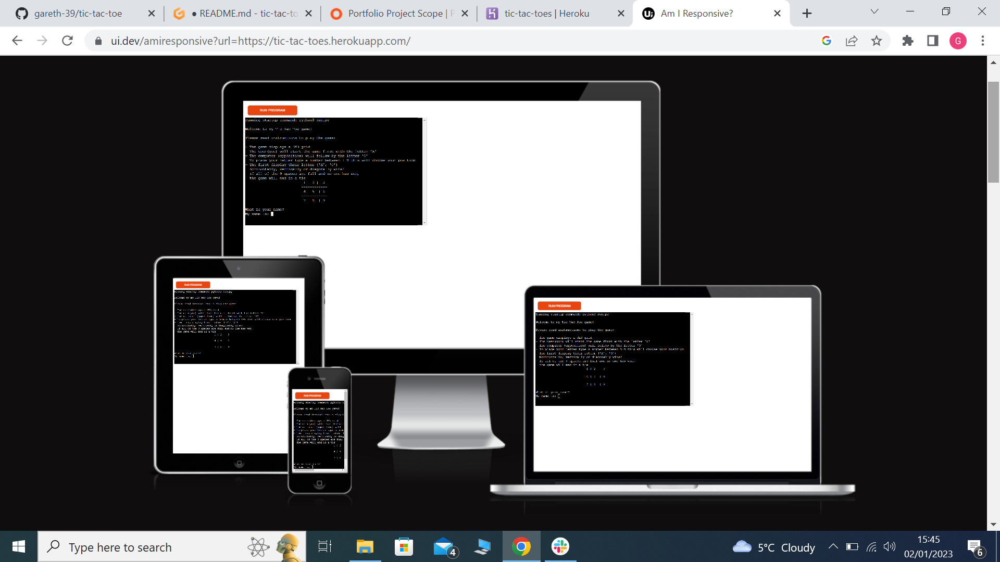
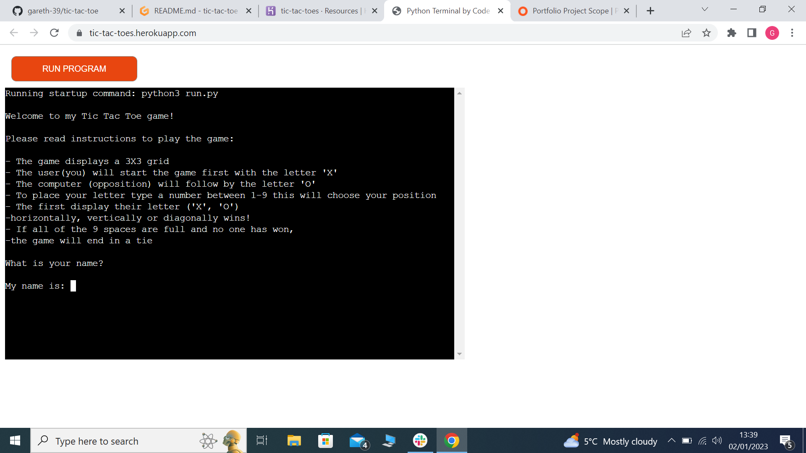
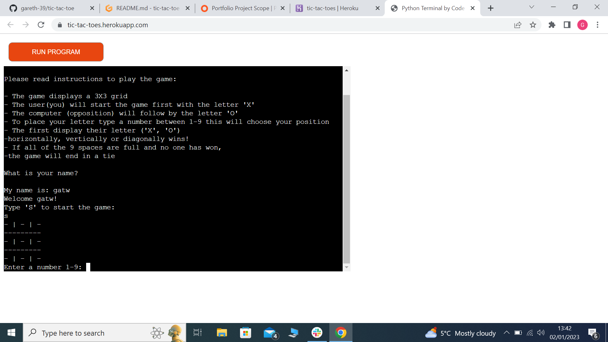
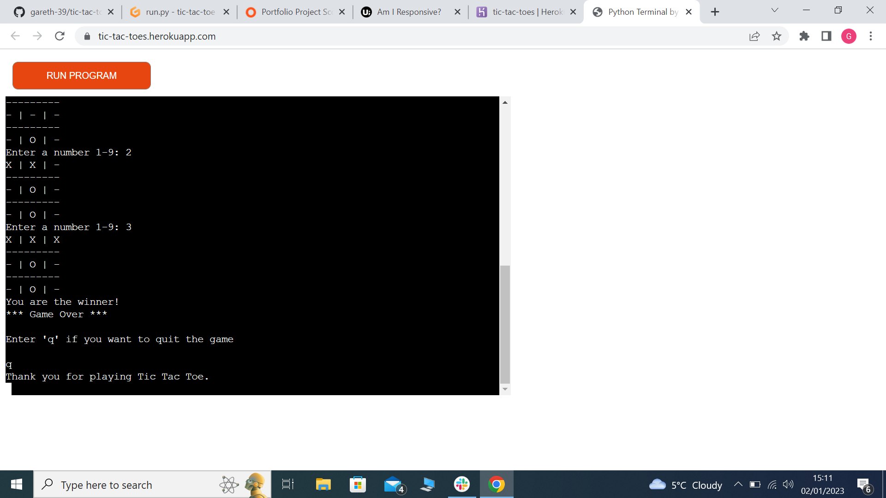
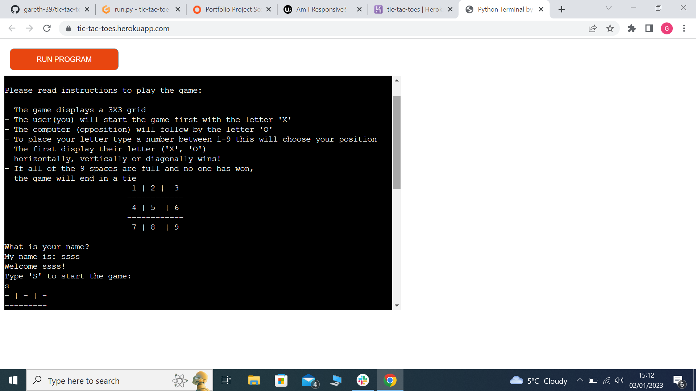
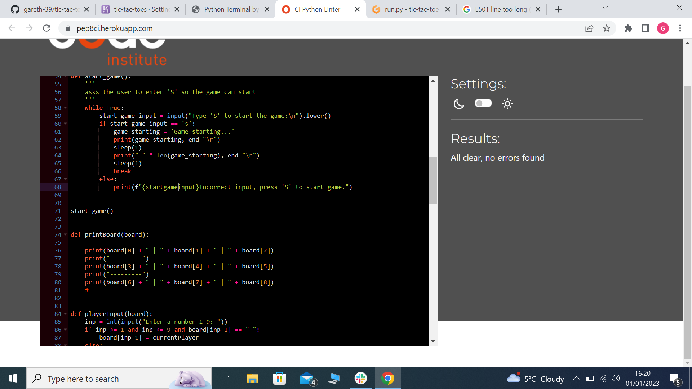

# Welcome to my Tic_Tac_Toe game:

My Tic tac toe game is a python based game which is ran through Code Insitute's mock terminal on Heroku. 

Users can play a one on one game of Tic tac toe against a computer A.I. On a board that consists of Nine squares number 1-9. 

- Here is a link to my live project https://tic-tac-toes.herokuapp.com/
- Here is a link to my Github repository
https://github.com/gareth-39/tic-tac-toe
  
 

# How to play the game:

- The game displays a 3X3 grid
- The user(you) will start the game first with the letter 'X'
- The computer (opposition) will follow by the letter 'O'
- To place your letter type a number between 1-9 this will choose your position
- The first display their letter ('X', 'O')
  horizontally, vertically or diagonally wins!
- If all of the 9 spaces are full and no one has won,
  the game will end in a tie.
#

# Features:

- Enter your name letter only. 
- Press S to start.
- You pick a number then you opponent picks a number.
- First player to get Three in a row wins
- If you pick the same number as one already picked you will be told you have to pick another square.
- If there is no winner a tie will be comfirmed.

 

#
# Future Features:

- A shot timer.
- A scoreboard.   

# Testing:
- I sent my live link to family and friends so they could play the game.
- I ran it through my local terminal and the Code Institute Heroku terminal.

# Bugs:
- I had a few indentation errors.
- I also had spelling errors.
- I had bug in my code when the user entered a number the game stopped working, it was a simple mistake in my print statement.
- I fixed these bugs by carefully reading over my work.

# Remaining bugs:
- There are no remaining bugs.

# Validator:
- PEP8
- - No errors were returned on https://pep8ci.herokuapp.com/   

  

# Deployment:
This project was deployment using Code institute's mock terminal on Heroku.

- Steps for deployment:
- - Create a Heroku app.
- - Set the buildpacks to Python and Nodejs in that order.
- - Link the Heroku app to my repository.
- - Click on deploy.  

# Credits:
- Code institute http://codeinstitute.net/
- Youtube https://www.youtube.com/
- Google http://google.com/
- Wikipedia Tic tac toe game http://wikipedia.com/
- Fellow colleagues on Slack.
- As always my mentor Jubril Akolade.